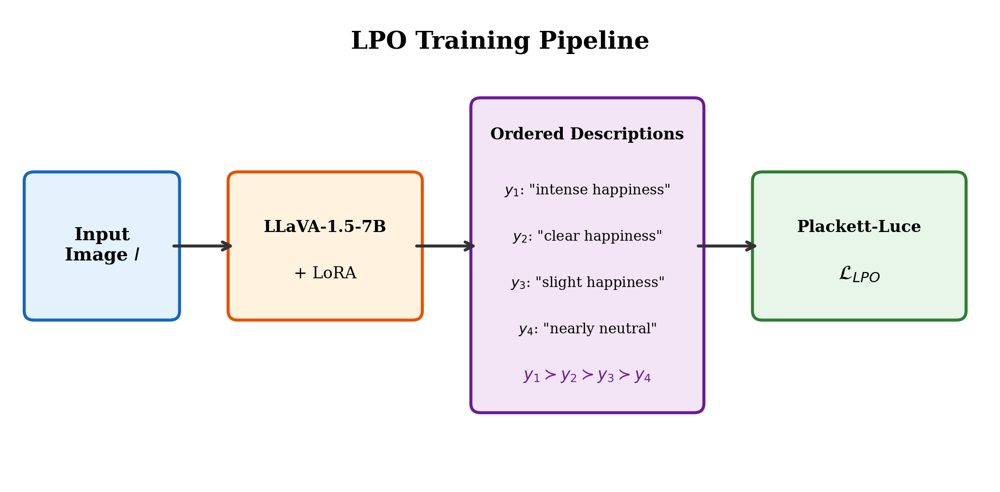
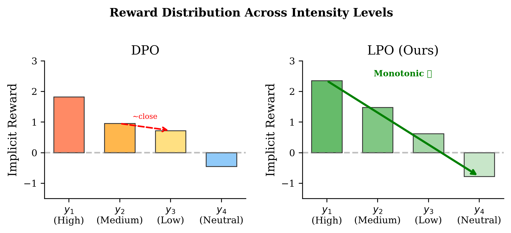
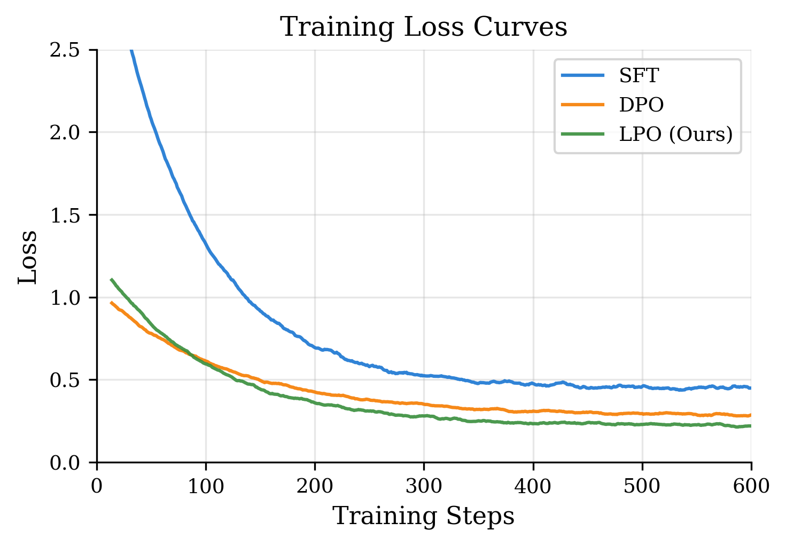
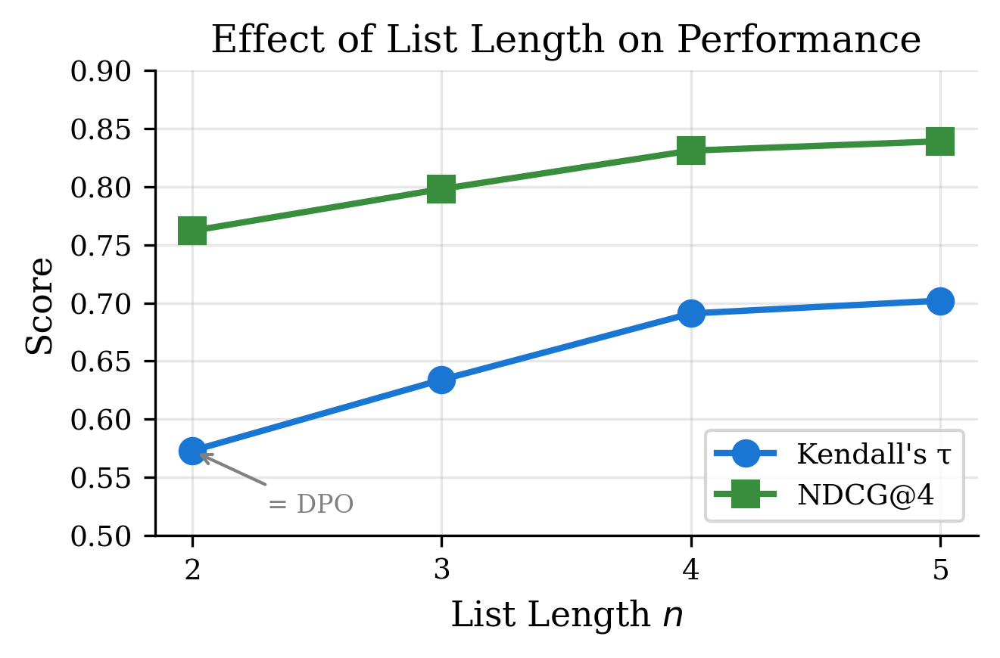
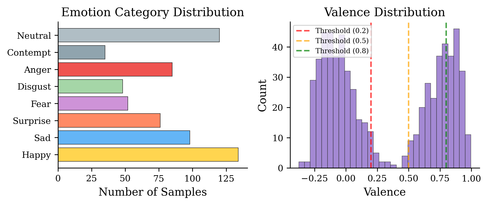

# LPO for Fine-Grained Affective Intelligence in VLM

**Listwise Preference Optimization for Fine-Grained Affective Intelligence in Vision-Language Models**

[](LICENSE)
[](https://www.python.org/downloads/)
[](https://pytorch.org/)

> Extending preference optimization from pairwise (DPO) to listwise learning for emotion intensity ranking in Vision-Language Models.

<p align="center">
  
</p>

## Overview

Vision-Language Models (VLMs) like LLaVA excel at general image understanding but struggle with **fine-grained affective perception** — distinguishing varying intensities of the same emotion. Standard alignment methods like DPO are limited to pairwise comparisons, which fail to capture the ordinal nature of emotion intensity.

**LPO (Listwise Preference Optimization)** addresses this by:
- Using the **Plackett-Luce ranking model** to learn from ordered preference lists
- Training the model to assign monotonically decreasing rewards across intensity levels
- Leveraging continuous valence annotations from AffectNet for automatic data construction

### Key Results

| Method | Accuracy | Kendall's τ | NDCG@4 | Monotonicity |
|--------|----------|-------------|--------|--------------|
| Zero-shot | 58.4% | 0.312 | 0.623 | 31.5% |
| SFT | 67.3% | 0.482 | 0.714 | 45.2% |
| DPO | 71.8% | 0.573 | 0.762 | 56.8% |
| **LPO (Ours)** | **74.2%** | **0.691** | **0.831** | **72.4%** |

LPO outperforms DPO by **+20.6%** on Kendall's τ and **+9.1%** on NDCG@4.

## Method

### Plackett-Luce Loss

Given an ordered preference set σ = (y₁, y₂, ..., yₙ) where y₁ ≻ y₂ ≻ ... ≻ yₙ, the LPO loss is:

$$\mathcal{L}_{\text{LPO}} = -\sum_{i=1}^{n-1} \log \frac{\exp(r_\theta(I, y_i))}{\sum_{j=i}^{n} \exp(r_\theta(I, y_j))}$$

where the implicit reward is: $r_\theta(I, y) = \beta \log \frac{\pi_\theta(y|I)}{\pi_{\text{ref}}(y|I)}$

When n=2, LPO reduces exactly to DPO — making DPO a special case of our method.

<p align="center">
  
</p>

### Training Pipeline

1. **Stage 1 (SFT):** Fine-tune LLaVA-1.5-7B on highest-intensity descriptions → produces reference model
2. **Stage 2 (LPO):** Apply Plackett-Luce loss with ordered preference sets using LoRA

<p align="center">
  
</p>

## Installation

```bash
git clone https://github.com/your-username/LPO-Emotion-VLM.git
cd LPO-Emotion-VLM
pip install -r requirements.txt
```

### Requirements
- Python ≥ 3.9
- PyTorch ≥ 2.1.0
- NVIDIA GPU with ≥ 40GB VRAM (A100 recommended)
- CUDA 11.8+

## Project Structure

```
LPO-Emotion-VLM/
├── README.md                 # This file
├── train.py                  # Main training entry point
├── evaluate.py               # Evaluation script
├── requirements.txt          # Dependencies
├── setup.py                  # Package installation
├── LICENSE                   # MIT License
├── config/
│   └── lpo_config.yaml       # Training configuration
├── src/
│   ├── __init__.py
│   ├── lpo_loss.py           # Plackett-Luce loss implementation
│   ├── lpo_dataset.py        # Dataset and data collator
│   ├── lpo_trainer.py        # LPO Trainer (extends HF Trainer)
│   └── evaluate.py           # Evaluation metrics
├── data/
│   ├── build_preference.py   # Build preference dataset from annotations
│   └── sample_data.json      # Example data format
├── scripts/
│   ├── train_sft.sh          # Stage 1: SFT training
│   ├── train_lpo.sh          # Stage 2: LPO training
│   └── evaluate.sh           # Run evaluation
├── assets/                   # Figures for README
└── report/                   # NeurIPS-format paper
    ├── main.tex
    └── generate_figures.py
```

## Quick Start

### 1. Prepare Data

Build ordered preference sets from AffectNet annotations:

```bash
python data/build_preference.py \
    --input_csv data/affectnet_annotations.csv \
    --output_dir data/ \
    --num_samples 1000
```

The data format is:
```json
{
  "id": "emotion_0",
  "image": "images/sample.jpg",
  "conversations": [
    {"from": "human", "value": "Analyze the emotion intensity..."},
    {"from": "gpt", "value": "The intensity ranking is: "}
  ],
  "ranked_texts": [
    "Intensely happy expression...",
    "Clearly happy expression...",
    "Slightly happy expression...",
    "Nearly neutral expression..."
  ]
}
```

### 2. Stage 1: Supervised Fine-Tuning

```bash
bash scripts/train_sft.sh
```

### 3. Stage 2: LPO Training

```bash
bash scripts/train_lpo.sh
```

Or run directly:
```bash
python train.py \
    --model_name_or_path liuhaotian/llava-v1.5-7b \
    --ref_model_path outputs/sft \
    --data_path data/train_lpo.json \
    --output_dir outputs/lpo \
    --beta 0.1 \
    --n_rank 4 \
    --lora_r 8 \
    --num_train_epochs 2 \
    --bf16
```

### 4. Evaluate

```bash
python evaluate.py \
    --model_path outputs/lpo \
    --data_path data/test_lpo.json \
    --output_file outputs/eval_results.json
```

## Ablation Studies

### Effect of List Length

| List Length n | Kendall's τ | NDCG@4 | Note |
|:---:|:---:|:---:|:---|
| 2 | 0.573 | 0.762 | = DPO |
| 3 | 0.634 | 0.798 | |
| **4** | **0.691** | **0.831** | Default |
| 5 | 0.702 | 0.839 | Diminishing returns |

<p align="center">
  
</p>

### Effect of Temperature β

| β | Kendall's τ | Stability |
|:---:|:---:|:---|
| 0.05 | 0.654 | Unstable (gradient spikes) |
| **0.1** | **0.691** | Stable |
| 0.2 | 0.672 | Stable |
| 0.5 | 0.618 | Over-regularized |

### Dataset Distribution

<p align="center">
  
</p>

## Configuration

Key hyperparameters in `config/lpo_config.yaml`:

| Parameter | Default | Description |
|-----------|---------|-------------|
| `beta` | 0.1 | Temperature for reward computation |
| `n_rank` | 4 | Number of ranked candidates per sample |
| `lora_r` | 8 | LoRA rank |
| `lora_alpha` | 16 | LoRA scaling factor |
| `learning_rate` | 2e-5 | AdamW learning rate |
| `batch_size` | 4×4=16 | Effective batch size |

## Citation

```bibtex
@article{xie2024lpo,
  title={Enhancing Fine-Grained Affective Intelligence in Vision-Language Models via Listwise Preference Optimization},
  author={Xie, Dongchu},
  journal={arXiv preprint},
  year={2024}
}
```

## Acknowledgments

- [LLaVA](https://github.com/haotian-liu/LLaVA) — Base vision-language model
- [AffectNet](http://mohammadmahoor.com/affectnet/) — Emotion dataset with continuous annotations
- [DPO](https://arxiv.org/abs/2305.18290) — Direct Preference Optimization
- [Plackett-Luce Model](https://en.wikipedia.org/wiki/Plackett%E2%80%93Luce_model) — Probabilistic ranking framework

## License

This project is licensed under the MIT License — see [LICENSE](LICENSE) for details.

---

<p align="center">
  <i>School of Data Science, The Chinese University of Hong Kong, Shenzhen</i>
</p>
